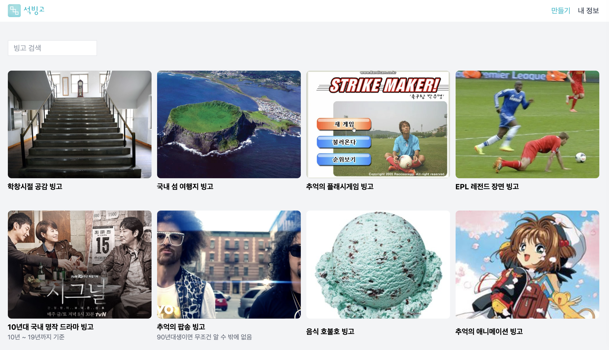
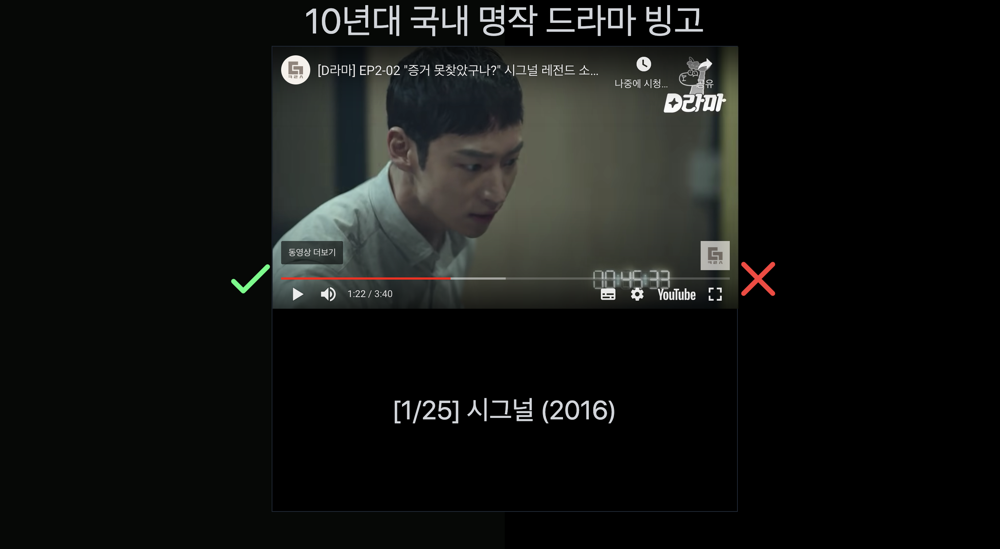
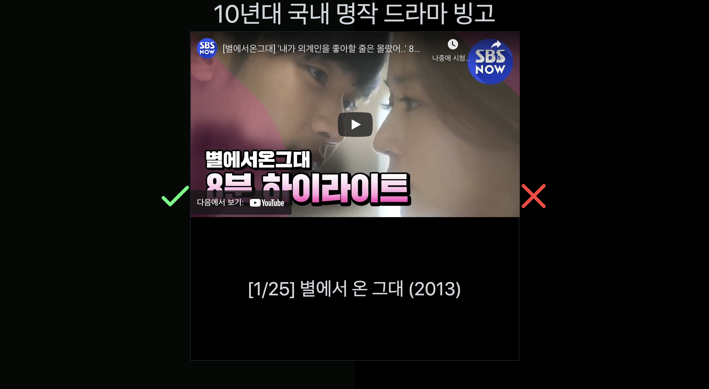
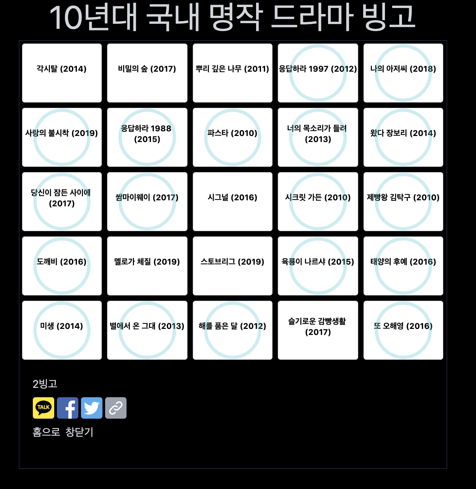
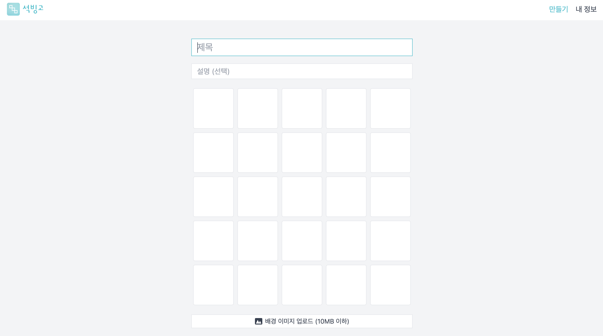
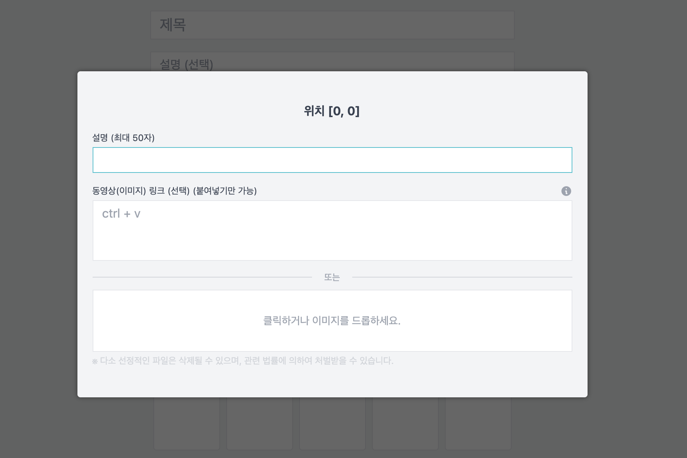
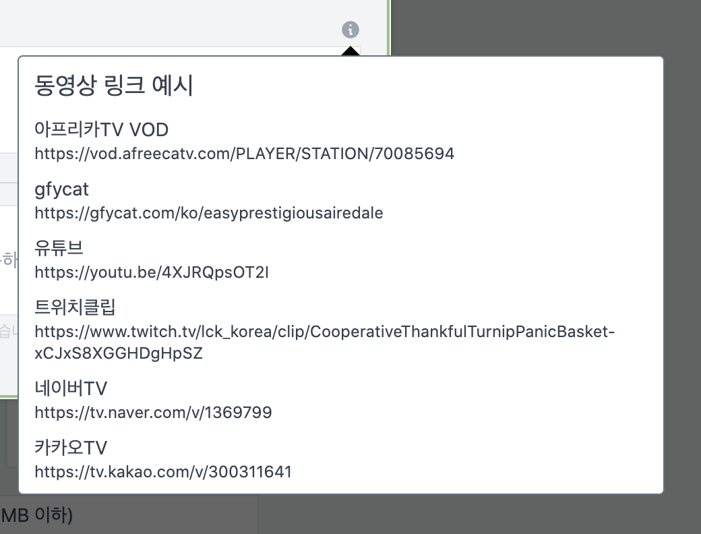

#### 제작 기간 : 03.15 ~ 04.04

대략 3주 정도에 걸쳐서 만들었네요. 사실 좀 더 빨리 만들고 싶었지만.. 생각보다 빙고 게임 로직 설계가 복잡해서 시간이 더 걸렸네요. 😙

## 소개

[링크](https://seokbingo.com)

[석빙고 - 빙고 게임, 빙고 만들기](https://seokbingo.com)는 기존 빙고 게임 사이트에서 영감을 받아서 5x5 빙고판을 체크만 하는 것에서 더 나아가, 한 칸 한 칸을 동영상이나 이미지를 보면서 체크해 가는 재미를 느낄 수 있는 서비스입니다.

**석빙고**라는 이름은 과거 조선시대 영조 때 얼음을 저장했던 창고를 뜻하며, 로고는 얼음빛을 띈 민트색을 차용, 얼음 모양을 빙고칸에 빗대어 대각선 빙고 한 줄을 완성한 느낌을 주도록 만들었습니다. (Figma로 직접 만들었습니다...)

## 이용하는 법

다음은 홈페이지에 들어가면 볼 수 있는 모습입니다.

헤더에는 로고, 로그인 및 프로필 링크만, 메인에는 검색 인풋과 빙고 리스트를 나열했습니다. 무한 스크롤링으로 스크롤을 내릴 때마다 포스트가 나타납니다.

**10년대 국내 명작 드라마 빙고** 를 클릭해 볼까요?

시그널이 먼저 나오는 군요. 상단에는 빙고 게임 제목, 양 쪽에는 각각 체크 표시와 X 표시가 있습니다. 무슨 의미인지는 다들 알죠? 😎 그리고 중단에는 유튜브 영상과 해당 빙고 칸의 내용이 적혀있습니다. 단순히 텍스트만 있고 체크만 하는 기존 빙고 게임 방식과 달리, 석빙고는 동영상이나 이미지를 하나하나 감상해 가며 체크해 가는 재미를 느낄 수 있습니다.

또한, 새로고침을 하면 게임의 순서가 전부 바뀌고 진행 상황이 초기화됩니다.

이렇게 25개의 빙고칸을 체크하고 나면, 그동안 체크했던 빙고판의 결과가 나타남으로써 게임은 종료됩니다.

## 만드는 법

빙고를 여러분들이 직접 만들 수 있습니다. 그러기 위해선 회원가입이 필요한 데요.

석빙고는 **이메일 링크 로그인**과 **구글 로그인** 두 가지 방식을 제공합니다. 두 방식 다 비밀번호를 저장하지 않기 때문에 민감한 개인정보에 대한 부담을 덜었습니다.

로그인 후 상단에 만들기 버튼을 클릭하면 다음과 같은 페이지를 볼 수 있습니다.

제목과 간단한 설명, 그리고 5x5의 빙고칸이 있습니다. 배경 이미지 업로드, 1~3줄 이상 빙고 시 결과에 띄워줄 문구도 작성할 수 있습니다.

빙고 칸을 클릭하면, 다음과 같은 창이 뜹니다.

해당 칸에 대한 설명을 작성하고, 추가적으로 보여줄 동영상에 대한 링크를 붙여넣거나 이미지를 업로드할 수 있습니다.

동영상 링크는 다음과 같은 양식으로 6개의 서비스를 붙여넣을 수 있습니다.

모든 빙고칸의 텍스트를 작성하고 나면, 하단에 '공개 여부'를 활성화한 뒤 공개 게시할 수 있게 됩니다. 그 전까지는 임시 저장이 가능합니다.

석빙고를 즐기는 방법은 여기까지입니다. 😉

---

## 기술

해당 프로젝트는 **Next.js, Tailwindcss, Typescript**를 중점으로 사용하여 만들었습니다.

## 마치며

석빙고는 유저들 모두가 함께 만들어 갈 수 있는 서비스입니다. 재밌게 봐주셨다면 당신만의 재치있는 빙고를 만들어 친구들에게 공유해 보는 것은 어떨까요? 😍 긴 글 봐주셔서 감사합니다.

> 에러나 문제 혹은 개선점이 생긴다면 이 페이지 혹은 wcgo2ling@gmail.com 로 제보 부탁드립니다. 꼭!
