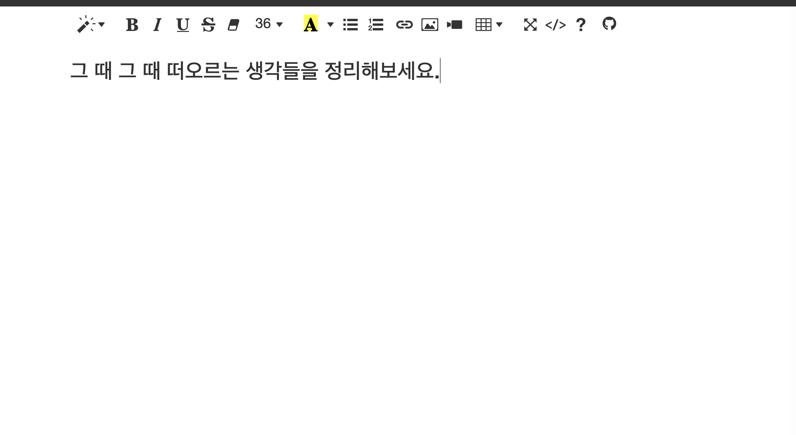

지금까지 코딩이나 웹서핑을 하면서 항상 느끼는 건데요, 갑자기 떠오른 아이디어가 있다거나 생각이 복잡하게 뒤섞일 때 정리하고픈 적이 저는 한 두 번이 아니었습니다.

그럴 때마다 메모장 앱을 키기에는 메모장은 프로그램이었기 때문에 매번 키는 것이 번거로웠습니다.

> 그래서 **메모 전용 웹 사이트**를 간단하게 만들자!

에디터 툴바를 상단에 고정시키고, 화면 전체를 텍스트 에디터로 만듦으로써 그때그때 떠오르는 생각을 자유롭게 적자. 그리고 창을 닫아도 적은 내용이 사라지지 않게 로컬 저장소에 저장해 놓자! 라는 생각으로 이 사이트를 만들었습니다.

링크 : [아무 생각](https://anythink.xyz)

프론트엔드 라이브러리는 쓰지 않고, summernote, jquery, firebase hosting으로 하루 만에 만들었습니다. 여러분도 써보시고 좋다면 댓글 남겨주세요. 😁
