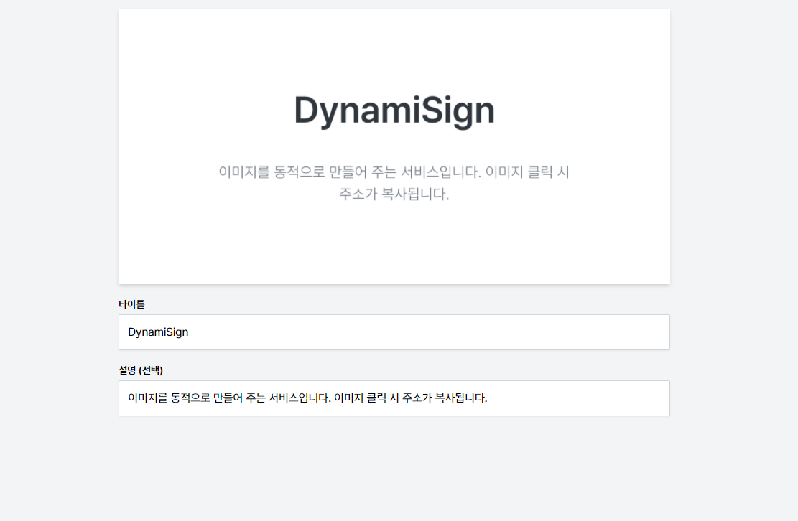

깃허브에서 아무 링크나 복사해서 카카오톡에 주소를 붙여 넣으면, 재미있는 사실을 하나 발견할 수 있습니다.

해당 이미지는 제 블로그 깃허브 주소인 [https://github.com/kidow/blog](https://github.com/kidow/blog) 인데요. 신기하게도 이미지인데도 제 아이디와 프로젝트명, 썸네일, 기여자 및 이슈, 스타 등등의 정보가 전부 나옵니다.

이번엔 React 공식 깃허브 주소인데요. 보시면 내용과 수치 등만 다를 뿐 규격과 간격 및 위치는 전부 똑같다는 것을 알 수 있습니다.

# 이미지를 동적으로 생성한다?

미리 디자인해놓은 html에 텍스트만 동적으로 넣어주고, 그것을 이미지로 변환해서 내보내면 따로 오픈 그래프용 이미지를 만들지 않아도 되는 게 아닐까 하는 생각이 들었습니다.

깃허브가 이 이미지를 어떻게 만들게 되었는 지는 다음 링크에 상세하게 적혀있습니다.

[A framework for building Open Graph images](https://github.blog/2021-06-22-framework-building-open-graph-images/)

요약을 해보자면,

1. 옛날에 쓰던 썸네일들은 보기에 직관적이지 않았고, 현재와 같은 방식으로 업데이트했다.
2. 깃허브 GraphQL API로 필요한 데이터를 모은 뒤 [puppeteer](https://github.com/puppeteer/puppeteer)를 사용하여 만들어 둔 html의 스크린샷을 찍는다.
3. 도입해보니 성능 저하가 있었고, 개선을 통해 성능도 매우 좋아졌다!

# 만든 계기

next.js를 만든 vercel에서는 [og-image](https://og-image.vercel.app/)라는 프로젝트에서 동적으로 오픈그래프 이미지를 생성하는 서비스를 제공합니다. 하지만, 이 서비스는 한글 폰트가 깨져서 나온다는 단점이 존재했습니다. 또한, 깃허브만큼 상세하게 표현할 수 있는 수단이 있지는 않습니다.

따라서 한글 폰트를 적용한 프로젝트를 직접 만들고, 내가 직접 쓰고 다녀야 겠다는 생각으로 프로젝트를 시작했습니다.

Next.js 와 Vercel 호스팅을 이용해서 만들었습니다.

아직은 기능이 별로 없는 간소한 단계이지만, 점차 기능을 늘려갈 예정입니다.